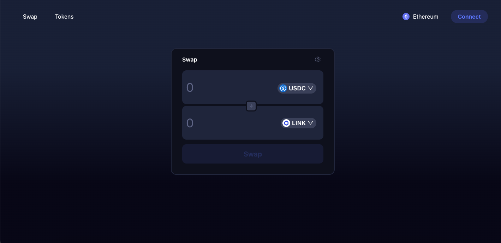
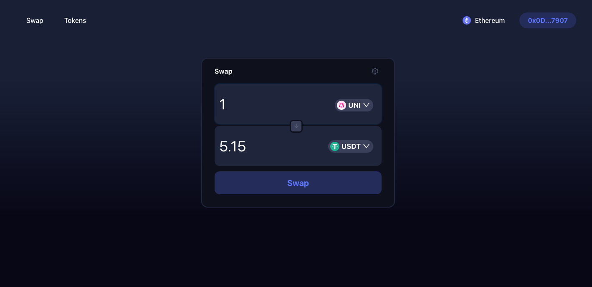
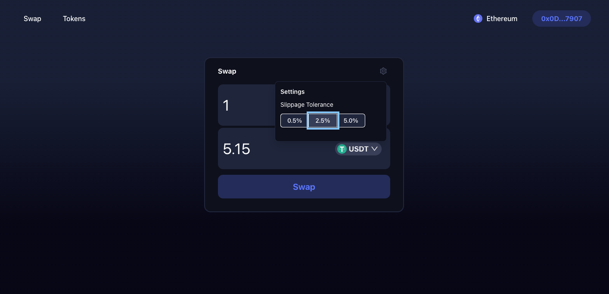
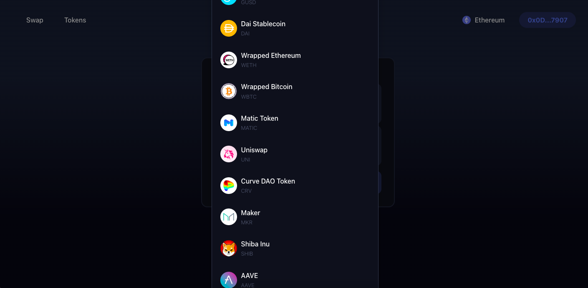

# Dex 1Inch

This project is a decentralized exchange (DEX) that allows users to swap between different ERC-20 tokens. The application fetches the current prices of tokens using the Moralis API, which is integrated into a backend server. The frontend of the application allows users to select the tokens they want to swap, and the amount of each token they wish to exchange.

The application then uses the 1inch API to execute the swap. 1inch is a decentralized exchange aggregator that finds the best rates across various decentralized exchanges and executes trades on behalf of the user. The swap occurs on the Ethereum blockchain, ensuring that it is secure and transparent.

The project has two main components: the frontend and the backend. The frontend is responsible for displaying the user interface, allowing users to interact with the application, and sending requests to the backend. The backend is responsible for fetching token prices using the Moralis API, processing requests from the frontend, and executing the swap using the 1inch API.

To use the application, users simply need to connect their Metamask wallet to the frontend. Once connected, users can select the tokens they want to swap, and the application will automatically execute the trade at the best available rate.

---------------------------------------------------------------------------------------------------------------------------------

Summary of the dependencies listed in the package.json file of dexFront:

@ant-design/icons: A library of icons for use in the Ant Design library.
antd: A design system for building responsive and accessible websites and applications.
axios: A library for making HTTP requests.
ethers: A library for interacting with the Ethereum blockchain and smart contracts.
react: A JavaScript library for building user interfaces.
react-dom: A package for working with the DOM in React applications.
react-router-dom: A package for routing in React applications.
web-vitals: A package for measuring and reporting on website performance.